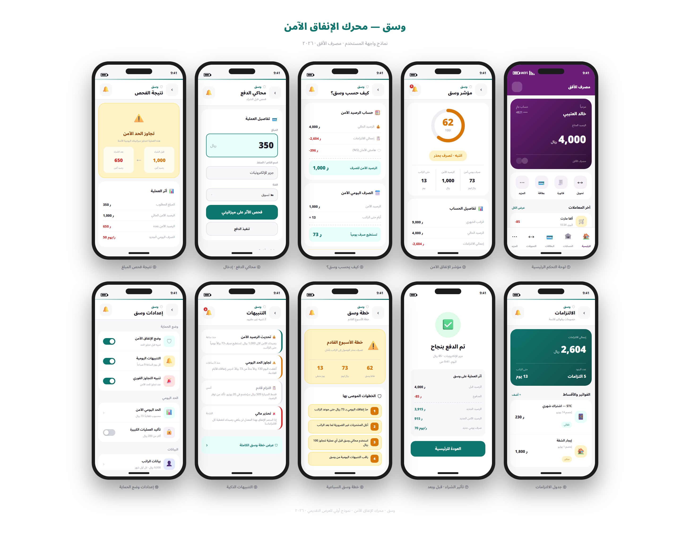

# وسق — Wasaq | محرك الإنفاق الآمن

> **"كم يمكنني صرفه بأمان اليوم؟"** — وسق يجيب.

**Wasaq** is a smart spending engine embedded inside a banking app. It tells users not just their balance, but how much they can *actually* spend safely today — after accounting for upcoming commitments, loan installments, and a safety buffer.

---

## المشكلة / The Problem

معظم الناس ينظرون إلى الرصيد ليقرروا ما إذا كانوا يستطيعون الشراء. لكن رصيدك يتضمن مبالغ ستخرج قريباً: أقساط، اشتراكات، فواتير. الاعتماد على الرصيد وحده يسبب ضغطاً مالياً قبل الراتب.

Most people check their balance before spending. But that balance includes money already committed to loans, subscriptions, and bills. Spending based on the displayed balance alone leads to end-of-month financial stress.

---

## الحل / The Solution

وسق يطرح الالتزامات القادمة وهامش أمان من الرصيد الحالي، ثم يقسم الباقي على عدد الأيام حتى الراتب ليعطيك **صرفك الآمن الفعلي يومياً**.

```
المبلغ الآمن  = الرصيد − إجمالي الالتزامات − هامش الأمان
الصرف اليومي = المبلغ الآمن ÷ الأيام حتى الراتب
مؤشر وسق     = ∛(المبلغ الآمن ÷ المثالي) × 100  →  0–100
```

---

## المزايا / Features

| الميزة | الوصف |
|--------|-------|
| 🏦 لوحة تحكم بنكية | واجهة بنكية كاملة مع وسق مدمجاً كـ widget ذكي |
| 📊 مؤشر وسق | نقاط 0–100 مع قوس SVG ولون يعكس الحالة (آمن / انتبه / خطر) |
| 🧮 شرح الحساب | تفصيل كامل لكيفية احتساب الصرف الآمن |
| 💳 محاكي الدفع | اعرف أثر أي عملية **قبل** تنفيذها |
| 📋 إدارة الالتزامات | قائمة بالأقساط والاشتراكات مرتبة حسب الموعد |
| 🔔 التنبيهات الذكية | إشعارات فورية عند تجاوز الحد الآمن |
| 📅 خطة الإنفاق | توصيات عملية حسب الحالة المالية حتى الراتب |
| 🎛 لوحة ديمو | صفحة `/demo` لضبط السيناريوهات خلال العرض |

---

## التقنيات / Tech Stack

| Layer | Technology |
|-------|-----------|
| Framework | Next.js 16 — App Router |
| Language | TypeScript |
| Styling | Tailwind CSS (RTL Arabic) |
| State | Browser `localStorage` only |
| Icons | Lucide React |
| Fonts | Noto Sans Arabic |
| Deployment | Vercel (zero-config) |

---

## تشغيل محلي / Run Locally

```bash
git clone https://github.com/YOUR_USERNAME/wasaq.git
cd wasaq
npm install
npm run dev
```

افتح المتصفح على `http://localhost:3000` — أدخل أي رقم جوال وأي رقم سري.

---

## سيناريو الديمو الافتراضي / Default Demo Scenario

**المستخدم:** خالد | **Login:** any phone number + any PIN

| البند | القيمة |
|-------|--------|
| الراتب الشهري | 9,000 ريال |
| الرصيد الحالي | 4,000 ريال |
| الأيام حتى الراتب | 10 أيام |
| قسط السيارة | 1,850 ريال |
| فاتورة STC | 230 ريال |
| Netflix + iCloud + Tabby | 524 ريال |
| **إجمالي الالتزامات** | **2,604 ريال** |
| هامش الأمان (5%) | 450 ريال |
| **الصرف الآمن اليومي** | **~95 ريال/يوم** |
| **مؤشر وسق** | **68/100 — انتبه** |

### جرب المحاكي / Try the Simulator

اذهب إلى **محاكي الدفع** ← أدخل **1,200 ريال** (Jarir) ← فحص الأثر.

النتيجة: الرصيد ينخفض إلى 2,800 ريال، المبلغ الآمن يصبح سالباً → الحالة تنتقل إلى **خطر** (مؤشر = 0).

---

## تدفق العرض التقديمي / Demo Flow

```
تسجيل الدخول (أي بيانات)
  ↓
الرئيسية — رصيد 4,000 ريال + مؤشر وسق (انتبه، 95 ريال/يوم)
  ↓
وسق — تفصيل الحساب الكامل (68/100)
  ↓
محاكي الدفع — فحص 1,200 ريال (Jarir)
  ↓
تنفيذ الدفع → رصيد 2,800، مؤشر 0 (خطر)
  ↓
التنبيهات — تنبيه وسق الجديد
  ↓
خطة وسق — خطة طوارئ بـ 5 خطوات
  ↓
إعادة ضبط الديمو → يعود لبيانات خالد الأصلية
```

---

## Live Demo

🔗 **[رابط التطبيق المباشر](https://YOUR-PROJECT.vercel.app)** ← أضف الرابط هنا بعد النشر

---

## Screenshots



---

## الصفحات / Routes

| المسار | الوصف |
|--------|-------|
| `/` | تسجيل الدخول |
| `/home` | لوحة التحكم البنكية مع وسق |
| `/wasaq` | مؤشر وسق وتفصيل الحساب |
| `/commitments` | الالتزامات القادمة |
| `/simulator` | محاكي الدفع (افحص قبل تنفيذ) |
| `/alerts` | التنبيهات الذكية |
| `/plan` | خطة الإنفاق الموصى بها |
| `/demo` | ⚙️ لوحة ديمو (غير مدرجة في التنقل) |

---

## النشر على Vercel / Deploy to Vercel

```bash
npx vercel --prod
```

أو اربط المستودع في [vercel.com](https://vercel.com) — لا يحتاج إعداداً إضافياً.

---

## ملاحظات مهمة / Important Notes

- **بيانات تجريبية بالكامل** — لا بيانات حقيقية لأي مستخدم
- **لا ربط بنكي** — المشروع محاكاة لأغراض العرض فقط
- **لا backend** — كل البيانات في `localStorage` المتصفح
- **لا مصادقة حقيقية** — أي رقم جوال وأي رقم سري يعملان
- **لا API Keys** — لا متغيرات بيئة مطلوبة

---

*وسق — هاكاثون أمد للتقنية المالية 2026*
